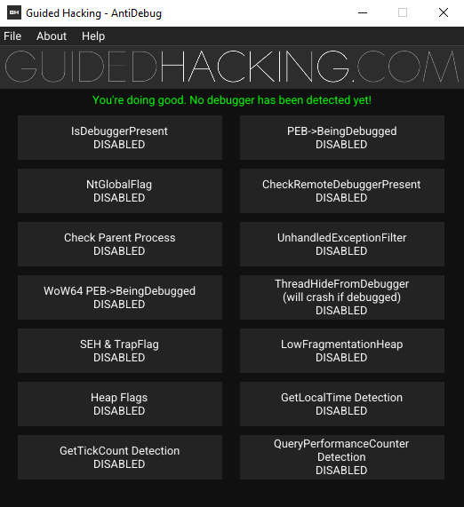

# Guided Hacking AntiDebug Bypass Practice Tool

Implementation of some anti-debugging techniques on a Win32 application. The idea is to cover the most commonly used anti-debugging methods.

 

## How to use it

You can compile yourself with Visual Studio 2019+ or just download the binary on the release tab. Fire it up, attach a debugger and start enabling detection methods. Then, try to bypass some and have fun.
When compiling you need to copy the resources folder to the output folder for the images to display.

## How to add a new anti debugging method 

1. Create a new file `.h` on the Methods folder with the name of the method. 
2. Implement your anti debugging function on the new file. This function will run on the main loop if enabled. It has to return a `bool` stating if a debugger was detected or not.
2. On `anti-debugging.cpp`, look for the `AddControls` function, simply register your method the same way all the others are, using the `AddMethod` function, the first argument is a callback to your function, and the second is what you want it to be called.
3. Your callback function needs to take 0 arguments, and return `true` if anything is detected, otherwise return `false`
```cpp

bool MyCoolMethod() 
{
	return true;
}

// renders as "My Cool Method Enabled - DETECTED"
// because we returned true
AddMethod(MyCoolMethod, "My Cool Method");
```

## TODO
- Add more methods

#### IsDebuggerPresent

This is a Windows API function that is used to check if the current process is being debugged. It returns a non-zero value if the process is being debugged, and zero otherwise. This is a simple and straightforward method of anti-debugging, but it's also easily bypassed by a knowledgeable attacker.

#### PEB>BeingDebugged

The Process Environment Block (PEB) is a data structure in the Windows operating system that contains data related to the currently executing process. The `BeingDebugged` field in the PEB is a flag that is set to true when the process is being debugged. By directly checking this flag, a program can determine if it's being debugged. However, like `IsDebuggerPresent`, this method is relatively easy for an attacker to bypass.

#### NtGlobalFlag

This is another field in the PEB. The `NtGlobalFlag` is used by the system to store various debugging and heap information. When a process is being debugged, certain bits in this flag are set. By checking these bits, a program can determine if it's being debugged. This method is a bit more complex than the previous two, but it can still be bypassed by a skilled attacker.

#### CheckRemoteDebuggerPresent

This is a Windows API function that checks if a specific process is being debugged by a remote debugger. The function takes two parameters: a handle to the process to check, and a pointer to a boolean variable that receives the result. If the process is being debugged, the function sets the boolean to true. This method can be used to detect remote debugging, but like the other methods, it can be bypassed by an attacker who knows what they're doing.

#### Timing Checks

This uses QueryPerformanceCounter, GetTickCount, and GetLocalTime to check for breakpoints, execution pausing, and process suspending. All of these functions query their current values, and wait a short duration before querying again. If the difference between queries is too large, the process was frozen or halted in some way.

#### SEH_TrapFlag

This is a method that constantly triggers exceptions, each of these exceptions should hit the SEH, where we catch it and handle it properly. If these exceptions do not hit our exception handler, something has replaced it. 

## Credits

Big shoutout to everyone at [guidedhacking.com](https://guidedhacking.com) that helped me with the development of this application. It's indeed the best resource to learn game hacking and reverse engineering. You should check it out if you haven't.


Related Antidebug Tricks​
-------------------------

-   [How to Find Hidden Threads - ThreadHideFromDebugger - AntiDebug Trick](https://guidedhacking.com/threads/how-to-find-hidden-threads-threadhidefromdebugger-antidebug-trick.14281/)
-   [How To Detect Debuggers With Debug Flags](https://guidedhacking.com/threads/how-to-detect-debuggers-with-debug-flags.20393/)
-   [How To Detect Breakpoints - Antidebugging Trick](https://guidedhacking.com/threads/how-to-detect-breakpoints-antidebugging-trick.20374/)
-   [Low Fragmentation Heap - LFH AntiDebug Check](https://guidedhacking.com/threads/low-fragmentation-heap-lfh-antidebug-check.20347/)
-   [Anti-Debug Techniques - Self Debugging](https://guidedhacking.com/threads/anti-debug-techniques-self-debugging.20339/)

 GuidedHacking® - The Game Hacking Bible® - © 2025 Guided Hacking LLC. All Rights Reserved.
